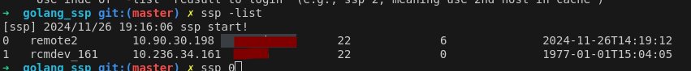

# 功能

ssh 登录需要手动输入密码，也无法记录登录过的主机。使用起来不方便。
因此 开发了这个小工具 ssp :

记录每一次的登录记录，缓存到 ~/.ssh/config_cache, 每次登录时自动从 缓存文件中找配置信息进行登录。如果不存在，需要手动输入信息。

注意： config_cache 中的密码为明文密码，这个工具不要用在生产环境。
依赖 sshpaas 工具，请预先安装

## 使用方式说明 ssp -help

Usage of ssp (depends on sshpaas):
  Description:
    ssp could simplify ssh login that auto compleled info by finding and caching ssh record,
    all record cache in ~/.ssh/config_cache

ssp [options] [host]
Options:
 -host string
     SSH host to connect (e.g., ssp -host node1)
  -hostname string
     SSH hostname to connect (e.g., ssp -hostname 127.0.0.1)
  -list
     List cached hosts (e.g., ssp -list)
  -del
     Delete cached record by indes of -list (e.g., ssp -del 0)
  index
     Use inde of '-list' reusult to login  (e.g., ssp 2, meaning use 2nd host in cache )
  host/hostname
     Same as -host -hostname, but needn`t '-' (e.g., ssp node1 or ssp 127.0.0.1 )
  user@hostname
     Like ssh command (e.g., ssp root@127.0.0.1 )
     

## 文件介绍

gotest.sh  运行测试用例
goinstall.sh 编译安装
